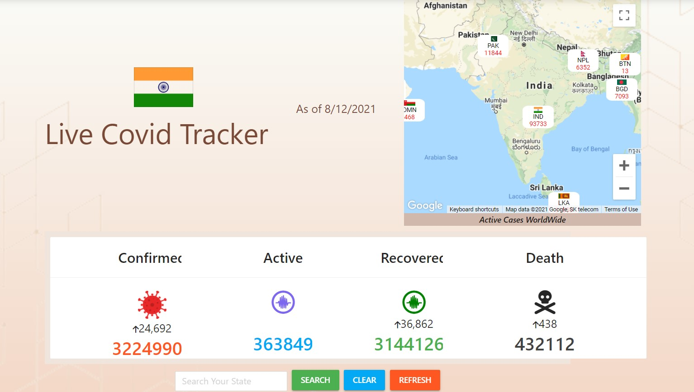
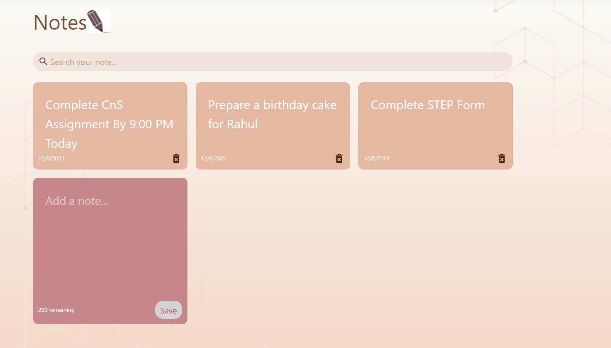
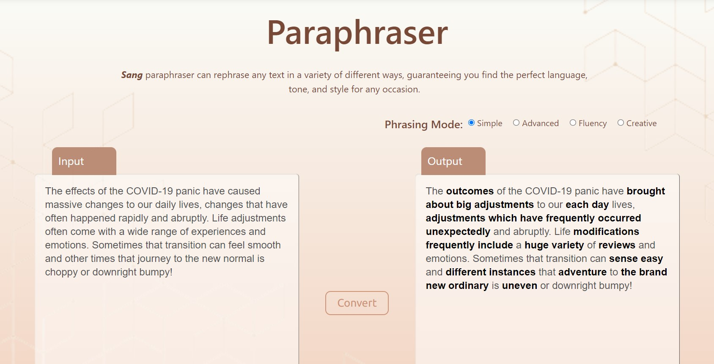
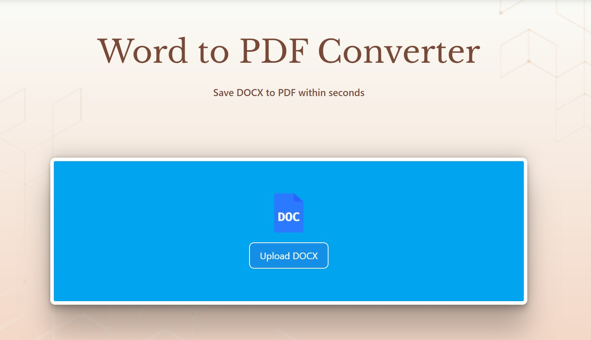

<!-- Improved compatibility of back to top link: See: https://github.com/othneildrew/Best-README-Template/pull/73 -->
<a name="readme-top"></a>
<!--
*** Thanks for checking out the Best-README-Template. If you have a suggestion
*** that would make this better, please fork the repo and create a pull request
*** or simply open an issue with the tag "enhancement".
*** Don't forget to give the project a star!
*** Thanks again! Now go create something AMAZING! :D
-->


<!-- PROJECT SHIELDS -->
<!--
*** I'm using markdown "reference style" links for readability.
*** Reference links are enclosed in brackets [ ] instead of parentheses ( ).
*** See the bottom of this document for the declaration of the reference variables
*** for contributors-url, forks-url, etc. This is an optional, concise syntax you may use.
*** https://www.markdownguide.org/basic-syntax/#reference-style-links
-->
[![Contributors][contributors-shield]][contributors-url]
[![Forks][forks-shield]][forks-url]
[![Stargazers][stars-shield]][stars-url]
[![Issues][issues-shield]][issues-url]
[![MIT License][license-shield]][license-url]
[![LinkedIn][linkedin-shield]][linkedin-url]


<!-- PROJECT LOGO -->
<br />
<div align="center">
  <a href="https://github.com/sahil9510/sang-hackathon">
    
  </a>

  <h3 align="center">Sang</h3>

  <p align="center">
    A personalised website according to all your daily needs.
    <br />
    <a href="https://github.com/sahil9510/sang-hackathon"><strong>Explore the docs »</strong></a>
    <br />
    <br />
    <a href="https://sang-hackathon.web.app/">View Demo</a>
    ·
    <a href="https://github.com/sahil9510/sang-hackathon/issues">Report Bug</a>
    ·
    <a href="https://github.com/sahil9510/sang-hackathon/issues">Request Feature</a>
  </p>
</div>


<!-- TABLE OF CONTENTS -->
<details>
  <summary>Table of Contents</summary>
  <ol>
    <li>
      <a href="#about-the-project">About The Project</a>
      <ul>
        <li><a href="#built-with">Built With</a></li>
      </ul>
    </li>
    <li>
      <a href="#getting-started">Getting Started</a>
      <ul>
        <li><a href="#prerequisites">Prerequisites</a></li>
        <li><a href="#installation">Installation</a></li>
      </ul>
    </li>
    <li><a href="#usage">Screenshots</a></li>
    <li><a href="#contributing">Contributing</a></li>
    <li><a href="#license">License</a></li>
    <li><a href="#contact">Contact</a></li>
  </ol>
</details>


<!-- ABOUT THE PROJECT -->
## About The Project

[![Product Name Screen Shot][product-screenshot]](https://sang-hackathon.web.app/)

Sang is an innovative all-in-one personalized website designed to cater to all your daily needs. The website provides users with a wide range of features.
Features:
* Covid Tracker
* Trending News
* Paraphraser
* Word to PDF Convertor
* Keep Notes

With Sang, users can stay up-to-date with the latest news and trends from around the world, track the spread of the COVID-19 pandemic, and easily convert files to PDF format. The paraphraser feature helps users to rewrite articles or other content in their own words, while the notes app allows them to take and organize notes for work, school, or personal use.

In addition to these essential features, Sang also offers several extra features to enhance user experience, including daily quotes and sudoku puzzles. The website is authenticated, meaning that users can securely log in and access their personalized dashboard from any device. Sang is also responsive in nature, ensuring that the website adapts seamlessly to any screen size, whether you are using a computer, tablet, or smartphone.

Sang is an excellent all-in-one solution for individuals who want to streamline their daily routines and stay organized. Whether you are a student, professional, or just someone who wants to stay informed and entertained, Sang has everything you need to make your day a little easier.


<p align="right">(<a href="#readme-top">back to top</a>)</p>


### Built With

The technologies involved in building Sang project are:

[![React][React.js]][React-url]
<br/>
React is a popular front-end JavaScript library that is used to build user interfaces. It provides a simple and flexible way to create dynamic and responsive user interfaces. React is based on a component-based architecture, which makes it easy to reuse and maintain code.

<br/>


[![Node.js][Node.js]][Node.js-url]
<br/>
Node.js is a server-side JavaScript runtime environment that is used to build scalable and high-performance applications. Node.js allows you to use JavaScript on the server-side, which makes it easy to build full-stack web applications with a single language. It provides a rich set of libraries and tools that make it easy to build web applications.

<br/>

[![MongoDb][MongoDb]][MongoDb-url]
<br/>
MongoDB is a document-oriented NoSQL database that is used to store and manage data. MongoDB uses a flexible document model that allows you to store data in JSON-like documents. It is a popular choice for web applications because it is highly scalable and provides high performance for read and write operations.

<br/>

[![ExpressJS][ExpressJS]][ExpressJS-url]
<br/>
Express.js is a web application framework that is used to build APIs and handle HTTP requests. It is built on top of Node.js and provides a simple and flexible way to build web applications. With Express.js, you can easily define routes, handle requests, and manage middleware.


<p align="right">(<a href="#readme-top">back to top</a>)</p>


<!-- GETTING STARTED -->
## Getting Started

Step-by Step setup guide:

### Prerequisites

* npm
  ```sh
  npm install npm@latest -g
  ```


### Installation

_Below is an example of how you can instruct your audience on installing and setting up your app. This template doesn't rely on any external dependencies or services._

1. Get a free API Key at [www.newsapi.org](https://newsapi.org/)
2. Get a Google Console API Key for Maps
3. Get a Paraphraser API key at [www.prepostseo.com](www.prepostseo.com)
4. Get a Convertor API key at [v2.convertapi.com](v2.convertapi.com)
5. Get a Facts API key at [https://api.api-ninjas.com/v1/facts](https://api.api-ninjas.com/v1/facts)

6. Create a MongoDB Atlas Cluster
7. Clone the repo
   ```sh
   git clone https://github.com/sahil9510/sang-hackathon
   ```
8. Install NPM packages int both folders
   ```sh
   cd frontend
   npm install
   ```

      ```sh
   cd backend
   npm install
   ```
9. Create a .env file in frontend:
   ```
   REACT_APP_NEWS_API_KEY = 'your-key'
   REACT_APP_MAP_API_KEY= 'your-key'
   REACT_APP_FACT_KEY = 'your-key'
   REACT_APP_CONVERTER_KEY = 'your-key'
   REACT_APP_PARAPHRASE_KEY = 'your-key'

   REACT_APP_BACKEND_API= 'deployed-backend-link'

   REACT_APP_COVID_DATA_API_KEY=https://data.covid19india.org/data.json
   REACT_APP_COVID_WORLD_DATA_API_KEY=https://corona.lmao.ninja/v2/countries
   ```

10. Create a .env file in backend:
    ```
    MONGO_URL = 'atlas-database-url'

    JWT_TOKEN = 'any-random-text'
    ```
<p align="right">(<a href="#readme-top">back to top</a>)</p>


<!-- USAGE EXAMPLES -->
## Screenshots
### Covid Tracker

<br/>

This tracker provides the cumulative number of confirmed COVID-19 cases and deaths, as well as the rate of daily COVID-19 cases and deaths in India and its states. This tracker will be updated regularly, as new data are released.

### Keep Notes

<br/>

A color co-ordinated note-taking service provided free,with date and time tracking. The notes will be encrypted and can only be read by you.

### Trending News

<br/>

A personalised news aggregator that organises and highlights what’s happening in the country so that you can discover more about the stories that matter to you.

### Paraphraser

<br/>

Paraphrase tool has numerous features including, rewriting essays, removing plagiarism, and rewording articles. Our paraphrasing tool works best as a word changer and sentence rephraser.

### PDF Converter

<br/>

With word to pdf cconverter,you can efficiently and accurately transform any Word document to PDF online. Same layout, same formatting.

### Sudoku

<br/>

Sudoku is one of the most popular puzzle games of all time. The goal of Sudoku is to fill a 9×9 grid with numbers so that each row, column and 3×3 section contain all of the digits between 1 and 9. As a logic puzzle, Sudoku is also an excellent brain game.

_For more examples, please refer to the [site](https://sang-hackathon.web.app/)_

<p align="right">(<a href="#readme-top">back to top</a>)</p>


<!-- CONTRIBUTING -->
## Contributing

Contributions are what make the open source community such an amazing place to learn, inspire, and create. Any contributions you make are **greatly appreciated**.

If you have a suggestion that would make this better, please fork the repo and create a pull request. You can also simply open an issue with the tag "enhancement".
Don't forget to give the project a star! Thanks again!

1. Fork the Project
2. Create your Feature Branch (`git checkout -b feature/AmazingFeature`)
3. Commit your Changes (`git commit -m 'Add some AmazingFeature'`)
4. Push to the Branch (`git push origin feature/AmazingFeature`)
5. Open a Pull Request

<p align="right">(<a href="#readme-top">back to top</a>)</p>


<!-- LICENSE -->
## License

Distributed under the MIT License. See `LICENSE.txt` for more information.

<p align="right">(<a href="#readme-top">back to top</a>)</p>


<!-- CONTACT -->
## Contact

Your Name - [@srivastv_Sahil](https://twitter.com/srivastv_Sahil) - srivastavasahil133@gmail.com

Project Link: [https://github.com/sahil9510/sang-hackathon](https://github.com/sahil9510/sang-hackathon)


<p align="right">(<a href="#readme-top">back to top</a>)</p>


<!-- MARKDOWN LINKS & IMAGES -->
<!-- https://www.markdownguide.org/basic-syntax/#reference-style-links -->
[contributors-shield]: https://img.shields.io/github/contributors/othneildrew/Best-README-Template.svg?style=for-the-badge
[contributors-url]: https://github.com/sahil9510/sang-hackathon/graphs/contributors
[forks-shield]: https://img.shields.io/github/forks/sahil9510/sang-hackathon.svg?style=for-the-badge
[forks-url]: https://github.com/sahil9510/sang-hackathon/network/members
[stars-shield]: https://img.shields.io/github/stars/sahil9510/sang-hackathon.svg?style=for-the-badge
[stars-url]: https://github.com/othneildrew/Best-README-Template/stargazers
[issues-shield]: https://img.shields.io/github/issues/sahil9510/sang-hackathon?style=for-the-badge
[issues-url]: https://github.com/sahil9510/sang-hackathon/issues
[license-shield]: https://img.shields.io/github/license/sahil9510/sang-hackathon.svg?style=for-the-badge
[license-url]: https://github.com/sahil9510/sang-hackathon/blob/main/LICENSE.txt
[linkedin-shield]: https://img.shields.io/badge/-LinkedIn-black.svg?style=for-the-badge&logo=linkedin&colorB=555
[linkedin-url]: https://www.linkedin.com/in/sahil9510/
[product-screenshot]: frontend/public/homepage.png
[Next.js]: https://img.shields.io/badge/next.js-000000?style=for-the-badge&logo=nextdotjs&logoColor=white
[Next-url]: https://nextjs.org/
[React.js]: https://img.shields.io/badge/React-20232A?style=for-the-badge&logo=react&logoColor=61DAFB
[React-url]: https://reactjs.org/
[Node.js]: https://img.shields.io/badge/Node.js-68A063?style=for-the-badge&logo=nodedotjs&logoColor=3C873A
[Node.js-url]: https://nodejs.org/en
[Angular.io]: https://img.shields.io/badge/Angular-DD0031?style=for-the-badge&logo=angular&logoColor=white
[Angular-url]: https://angular.io/
[Svelte.dev]: https://img.shields.io/badge/Svelte-4A4A55?style=for-the-badge&logo=svelte&logoColor=FF3E00
[Svelte-url]: https://svelte.dev/
[Laravel.com]: https://img.shields.io/badge/Laravel-FF2D20?style=for-the-badge&logo=laravel&logoColor=white
[Laravel-url]: https://laravel.com
[ExpressJS]: https://img.shields.io/badge/ExpressJS-white?style=for-the-badge&logo=express&logoColor=black
[ExpressJS-url]: https://expressjs.com/
[MongoDb]: https://img.shields.io/badge/MongoDB-E8E7D5?style=for-the-badge&logo=mongodb&logoColor=3FA037
[MongoDb-url]: https://www.mongodb.com/